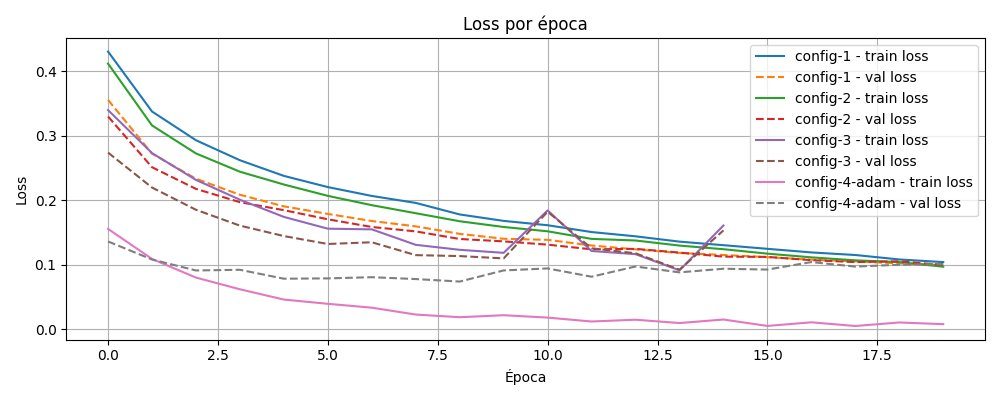
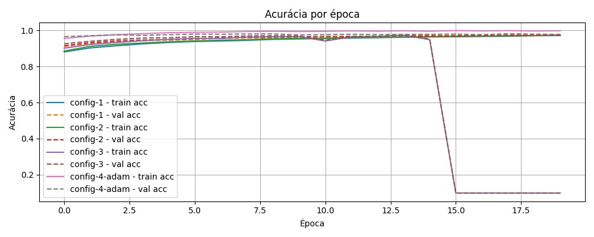
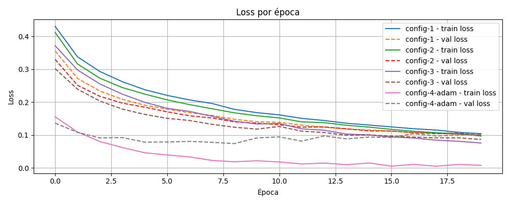
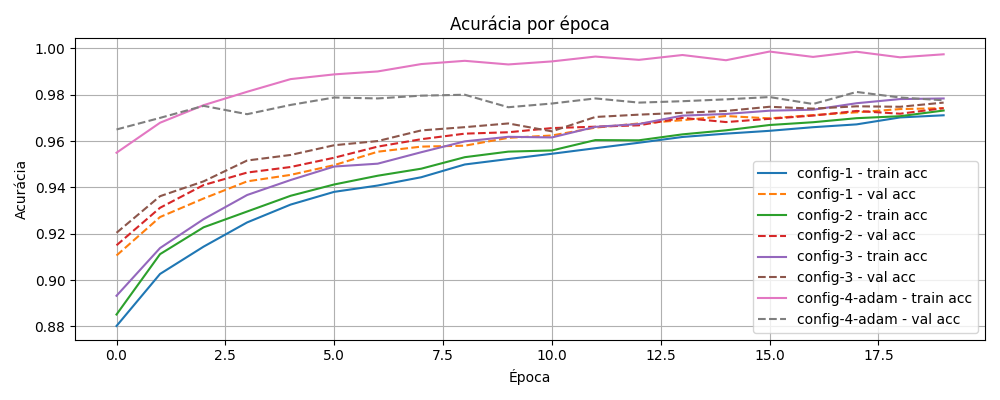

# MLP - Classificação de Dígitos (MNIST)

Este projeto diz respeito à implementação completa de um Multi-Layer Perceptron usando apenas NumPy, sem frameworks de deep learning. O objetivo não foi apenas obter uma boa acurácia, mas também entender cada operação que acontece dentro da rede, o que cada linha de código realmente significa e por que a rede aprende.

## 1. Visão geral

| Item | Detalhe |
|---|---|
| Dataset | MNIST (70.000 imagens, 28×28 px) |
| Arquitetura principal | 784 → 128 → 64 → 10 |
| Ativações | ReLU (ocultas) + Softmax (saída) |
| Loss | Cross-Entropy |
| Otimizadores | SGD, Adam |
| Melhor acurácia no teste | **97,23%** |


## 2. Como rodar

### 2.1. Instalação

```bash
pip install -r requirements.txt
```

O `requirements.txt` lista apenas `numpy>=1.24` e `matplotlib>=3.8`. Nenhuma dependência de framework de deep learning é necessária.

### 2.2. Treinamento

```bash
python train.py
```

O `train.py` tenta carregar o MNIST via `keras.datasets.mnist`. Se `keras` não estiver disponível, ele faz o download automático dos arquivos IDX brutos diretamente do Google Storage e processa tudo em NumPy puro:

```python
# Carrega MNIST via keras se disponível, senão baixa os arquivos IDX brutos
try:
    from keras.datasets import mnist as keras_mnist
except Exception:
    keras_mnist = None
```

Os arquivos são lidos com `gzip` e `struct`, os pixels normalizados para `[0, 1]` e as imagens convertidas de `(N, 28, 28)` para vetores de `(N, 784)` - tudo sem depender de nenhum framework.

### 2.3. Notebooks de análise

Antes de implementar o MLP mais complexo para a classificação de dígitos, fiz um teste com o MLP mais básico que resolve o problema de perceptron em casos de XOR. Este notebook contém os experimentos, o gráfico de loss e acurácia por época, relacionados à validação do MLP no problema XOR antes de escalar para o MNIST.

```bash
jupyter notebook notebooks/experimentos.ipynb
```

## 3. Metodologia de desenvolvimento

Como citado acima, antes de partir para o MNIST, construí uma versão simplificada do MLP para resolver o problema XOR.

O XOR foi escolhido porque é o exemplo clássico que uma rede linear não consegue resolver, pois exige pelo menos uma camada oculta com não linearidade. Se o forward pass e o backpropagation estivessem errados, a rede simplesmente não aprenderia o XOR.

O objetivo foi validar de forma isolada, em um problema pequeno o suficiente para depurar linha a linha:

- Que o forward pass produzia saídas coerentes
- Que o backpropagation calculava gradientes corretos
- Que a atualização de pesos fazia a loss cair de forma consistente

Somente após confirmar que a rede aprendia o XOR, expandi a implementação para múltiplas camadas ocultas e apliquei ao MNIST. Essa abordagem foi essencial: quando algo dava errado no MNIST, eu sabia que o mecanismo de gradientes já estava validado e o problema tinha outra causa (escala dos pesos, learning rate, dimensões das matrizes, por exemplo).

## 4. Arquitetura da rede

### 4.1. Estrutura principal

```
Entrada (784)
   ↓
Camada oculta 1 — 128 neurônios, ReLU
   ↓
Camada oculta 2 — 64 neurônios, ReLU
   ↓
Saída — 10 neurônios, Softmax
```

Para melhor modularidade, criei a classe `NeuralNetwork`, que constroi a arquitetura da rede. Além disso, a classe aceita uma lista de camadas de tamanho arbitrário, então todas as configurações testadas usam a mesma classe:

```python
model = NeuralNetwork([784, 128, 64, 10], seed=42, optimizer="sgd")
model = NeuralNetwork([784, 256, 128, 10], seed=42, optimizer="sgd")
model = NeuralNetwork([784, 128, 64, 10], seed=42, optimizer="adam")
```

### 4.2. Justificativa das escolhas

- **Número de camadas:** duas camadas ocultas são suficientes para capturar a não linearidade do MNIST sem exagerar no número de parâmetros. Uma única camada ainda classificaria bem, mas duas permitem que a rede aprenda representações hierárquicas, pois a primeira camada **combina pixels brutos em padrões locais** (bordas, curvas), a segunda **combina esses padrões em estruturas mais complexas** (partes de dígitos).

- **Número de neurônios (128 e 64):** valores moderados que oferecem expressividade sem tornar o treinamento inviável. A redução progressiva de 128 para 64 força a rede a comprimir a representação antes da classificação final - funciona como um gargalo suave que desfavorece memorização e incentiva generalização.


- **ReLU nas camadas ocultas:** ReLU (Rectified Linear Unit) é uma função de ativação — uma função matemática aplicada à saída linear de cada neurônio antes de passar o resultado para a próxima camada. Sem uma função de ativação, empilhar várias camadas lineares seria equivalente a ter uma única camada linear, porque a composição de transformações lineares continua sendo linear. A função de ativação é o que introduz não linearidade na rede e permite que ela aprenda padrões complexos que uma regressão linear não conseguiria capturar.
 
A ReLU é definida de forma simples: retorna o próprio valor se for positivo, e zero se for negativo:
 
```
ReLU(x) = max(0, x)
```
 
Comparada a outras funções de ativação clássicas como sigmoid e tanh, a ReLU tem duas vantagens práticas. Primeiro, não satura para valores positivos — sigmoid e tanh "achatam" valores grandes para 1 ou -1, o que faz o gradiente se aproximar de zero e dificulta o aprendizado nas camadas iniciais (o chamado problema do gradiente desaparecendo). Segundo, sua derivada é trivial - `(x > 0).astype(float)` - o que simplifica muito a implementação do backpropagation manual e reduz o custo computacional:
 
```python
# activations.py
def relu(x):
    return np.maximum(0, x)
 
def relu_derivative(x):
    return (x > 0).astype(float)
```

A ReLU também se encaixa diretamente com a inicialização de He, que foi projetada levando em conta que metade das ativações serão zeradas (os valores negativos).
 
- **Softmax na saída:** converte os logits em uma distribuição de probabilidade sobre as 10 classes. Subtrair o máximo antes da exponencial evita overflow:
 
```python
# activations.py
def softmax(x):
    exp_x = np.exp(x - np.max(x, axis=1, keepdims=True))
    return exp_x / np.sum(exp_x, axis=1, keepdims=True)
```

- **One-Hot Encoding:** os rótulos originais do MNIST são inteiros de 0 a 9. Para que a Cross-Entropy (calcula o erro) possa comparar a saída do Softmax diretamente com o rótulo, cada inteiro é convertido para um vetor de 10 posições com `1.0` na posição correta. Exemplo:

```
7  →  [0, 0, 0, 0, 0, 0, 0, 1, 0, 0]
```

```python
# train.py
def one_hot(labels, num_classes=10):
    encoded = np.zeros((labels.shape[0], num_classes), dtype=np.float32)
    encoded[np.arange(labels.shape[0]), labels] = 1.0
    return encoded
```

## 5. Detalhes de implementação

### 5.1. Inicialização dos pesos

Usei **He Initialization** para todas as camadas ocultas:

```
W ~ N(0, sqrt(2 / n_in))
```

```python
# network.py
W = np.random.randn(layers[i], layers[i + 1]) * np.sqrt(2 / layers[i])
b = np.zeros((1, layers[i + 1]), dtype=np.float32)
```

Para inicializar os pesos, usei He Initialization.Isso porque, quando os pesos são inicializados com valores muito pequenos, os gradientes desaparecem nas camadas anteriores. Quando são muito grandes, as ativações explodem e o Softmax produz `inf` ou `NaN`. He Initialization mantém a variância das ativações estável ao longo das camadas - e é especificamente recomendada para ReLU porque leva em conta que metade das ativações são zeradas (os valores negativos).

Já os vieses começam em zero porque não sofrem do problema de simetria dos pesos. Pesos zerados forçam todos os neurônios a aprenderem a mesma função (o gradiente é igual para todos). Vieses zerados não têm esse problema - eles são ajustados individualmente durante o treinamento.


### 5.2. Forward pass

O forward pass é a etapa de **inferência** da rede - a direção em que os dados fluem da entrada para a saída. Sua missão é transformar progressivamente um vetor bruto de 784 pixels em uma distribuição de probabilidade sobre 10 classes. Cada camada aplica uma transformação sobre a saída da camada anterior, refinando a representação a cada passo: a primeira camada oculta enxerga pixels brutos e aprende combinações de intensidade; a segunda recebe essas combinações e aprende padrões mais abstratos; a camada de saída converte esses padrões em uma previsão de qual dígito está na imagem.
 
O forward pass por si só não aprende nada — ele apenas executa a função que os pesos definem naquele momento. O aprendizado acontece no backward. Mas o forward é indispensável por dois motivos: primeiro, porque produz a previsão que será comparada com o rótulo real para calcular a loss; segundo, porque armazena os valores intermediários (`Z` e `A` de cada camada) que o backpropagation vai precisar para calcular os gradientes. Sem esse cache, seria necessário recomputar toda a rede de novo durante o backward — ineficiente e propenso a erros.
 
Cada camada executa duas etapas. Os valores intermediários são armazenados em `self.zs` e `self.activations` para uso no backward:
 
```python
# network.py
for i, (W, b) in enumerate(zip(self.weights, self.biases)):
    Z = A @ W + b          # combinação linear
    self.zs.append(Z)
 
    if i == len(self.weights) - 1:
        A = softmax(Z)     # camada de saída
    else:
        A = relu(Z)        # camadas ocultas
 
    self.activations.append(A)
```
 
`Z` guarda a saída linear antes da ativação. `A` guarda as ativações. Esses dois caches são indispensáveis no backward: `A_prev` fornece o gradiente de `W`, e `Z` é necessário para calcular a derivada da ReLU na camada anterior.
 

### 5.3. Função de perda: Cross-Entropy, não MSE
 
No teste do XOR usei MSE (Mean Squared Error) como função de perda, o que funcionou bem para aquele problema — o XOR tem saída binária (0 ou 1) e apenas 4 exemplos. Mas ao migrar para o MNIST, precisei trocar para Cross-Entropy, e a razão vai além de uma convenção.
 
**Por que o MSE funciona no XOR mas é inadequado para o MNIST:**
 
O XOR é um problema de saída escalar com duas classes. A MSE calcula o quadrado da diferença entre o valor previsto e o valor esperado:
 
```
MSE = (1/m) * sum((y_pred - y_true)²)
```
 
No MNIST, a saída é um vetor de 10 probabilidades gerado pelo Softmax. O problema de usar MSE com Softmax é que o gradiente resultante fica muito pequeno quando a rede está muito errada — exatamente o contrário do que se quer. Isso acontece porque a função quadrática combinada com a exponencial do Softmax produz gradientes que saturam: quanto mais confiante a rede estiver na resposta errada, mais próximo de zero fica o gradiente da MSE, e mais lento fica o aprendizado.
 
**Por que a Cross-Entropy é a escolha correta:**
 
A Cross-Entropy mede diretamente o quanto a distribuição prevista difere da distribuição real (one-hot):
 
```
CE = -(1/m) * sum(y_true * log(y_pred + ε))
```
 
```python
# losses.py
def cross_entropy(y_true, y_pred):
    m = y_true.shape[0]
    return -np.sum(y_true * np.log(y_pred + 1e-8)) / m
```
 
O `+1e-8` evita `log(0)` quando a probabilidade prevista para a classe correta é zero — o que produziria `inf` e quebraria o treinamento.
 
A grande vantagem da Cross-Entropy com Softmax é o gradiente que ela produz no backward. A derivada combinada de Softmax + Cross-Entropy simplifica para:
 
```
dZ = y_pred - y_true
```
 
Esse gradiente tem uma propriedade importante: quando a rede erra com alta confiança (por exemplo, prevê 0.99 para a classe errada), `y_pred - y_true` é grande — o gradiente é forte e a rede corrige muito. Quando a rede acerta com alta confiança, o gradiente é próximo de zero — a rede não ajusta o que já está certo. Com MSE + Softmax isso não acontece: o gradiente satura nos dois casos.
 
**Resumo da diferença na prática:**
 
| | MSE | Cross-Entropy |
|---|---|---|
| Adequada para | regressão, saída contínua, XOR binário | classificação com Softmax |
| Gradiente quando erra muito | pequeno (satura) | grande (corrige forte) |
| Gradiente quando acerta | pequeno | pequeno (não mexe no que está certo) |
| Combinação natural com | sigmoide (problemas binários) | Softmax (multiclasse) |
 
É por isso que todas as redes de classificação com Softmax usam Cross-Entropy: não é tradição, é matemática. O gradiente que ela produz em combinação com o Softmax é exatamente o que torna o treinamento eficiente.
 
### 5.4. Backpropagation
 
O backpropagation é a etapa de **aprendizado** da rede - é onde os pesos são de fato ajustados. Sua missão é responder uma pergunta específica para cada peso e viés da rede: se eu aumentar levemente esse parâmetro, o erro total sobe ou desce, e em quanto? A resposta a essa pergunta é o gradiente, e o backpropagation calcula esse gradiente para todos os parâmetros da rede de forma eficiente, percorrendo as camadas de trás para frente.
 
O nome "backpropagation" vem exatamente dessa direção: o erro começa na camada de saída — onde é possível comparar a previsão com o rótulo real — e é propagado para trás, camada por camada, usando a regra da cadeia do cálculo. Cada camada recebe o gradiente da camada seguinte, calcula quanto cada um dos seus pesos contribuiu para esse gradiente, repassa a informação para a camada anterior e atualiza seus próprios parâmetros. No final de uma passagem completa de backward, todos os pesos da rede foram ajustados um passo na direção que reduz o erro.
 
É a combinação de forward e backward que forma um ciclo de aprendizado: o forward produz uma previsão e mede o erro; o backward distribui a responsabilidade por esse erro entre todos os parâmetros e os corrige. Repetido por muitas épocas e mini-batches, esse ciclo é o que faz a rede convergir.
 
O objetivo é descobrir quanto cada peso contribuiu para o erro e ajustá-lo na direção que reduz a loss.
 
**Gradiente na camada de saída** (derivada combinada de Softmax + Cross-Entropy):
 
```python
dZ = self.activations[-1] - y_true
```
 
Esse resultado simplificado é uma das razões pelas quais Softmax e Cross-Entropy são sempre usadas juntas: os termos se cancelam e o gradiente de saída vira apenas a diferença entre a previsão e o rótulo. Isso só acontece porque a derivada da Cross-Entropy em relação ao logit pré-softmax simplifica para `y_pred - y_true`.
 
**Propagação para as camadas ocultas** (regra da cadeia, iterando de trás para frente):
 
```python
# network.py
for i in reversed(range(len(self.weights))):
    A_prev = self.activations[i]
 
    dW = A_prev.T @ dZ / m          # gradiente dos pesos
    db = np.sum(dZ, axis=0, keepdims=True) / m   # gradiente dos vieses
 
    # ... atualização dos pesos ...
 
    if i > 0:
        dA_prev = dZ @ self.weights[i].T
        dZ = dA_prev * relu_derivative(self.zs[i - 1])
```
 
A divisão por `m` (tamanho do batch) normaliza os gradientes, garantindo que o learning rate não precise ser reajustado quando o tamanho do mini-batch muda.
 
**Atualização com SGD:**
 
```python
self.weights[i] -= lr * dW
self.biases[i]  -= lr * db
```

### 5.5. Adam

Além do SGD, implementei o otimizador Adam dentro da própria classe `NeuralNetwork`. Adam mantém médias móveis dos gradientes (`m`) e dos gradientes ao quadrado (`v`), com correção de viés para as primeiras iterações:

```python
# network.py (trecho do backward com Adam)
self.m_weights[i] = self.beta1 * self.m_weights[i] + (1 - self.beta1) * dW
self.v_weights[i] = self.beta2 * self.v_weights[i] + (1 - self.beta2) * (dW ** 2)
m_hat = self.m_weights[i] / (1 - self.beta1 ** self.t)
v_hat = self.v_weights[i] / (1 - self.beta2 ** self.t)
self.weights[i] -= lr * m_hat / (np.sqrt(v_hat) + self.epsilon)
```

Os valores padrão usados foram `beta1=0.9`, `beta2=0.999` e `epsilon=1e-8`, que são os recomendados no paper original.


### 5.6. Estrutura dos experimentos

Cada configuração é definida como um dicionário e passada para a mesma função `train_model()`:

```python
# train.py
experiments = [
    {"label": "config-1", "layers": [784, 128, 64, 10],  "lr": 0.02, "epochs": 20},
    {"label": "config-2", "layers": [784, 256, 128, 10], "lr": 0.02, "epochs": 20},
    {"label": "config-3", "layers": [784, 128, 64, 10],  "lr": 0.03, "epochs": 20},
    {"label": "config-4-adam", "layers": [784, 128, 64, 10], "lr": 0.001,
     "epochs": 20, "optimizer": "adam"},
]
```

## 5.7. Resultados

Os experimentos foram executados em duas rodadas. A primeira revelou dois bugs que distorceram os resultados. A segunda, após as correções, produziu resultados válidos e comparáveis.

### 5.7.1. Rodada 1 - antes da correção (com bugs)

#### Acurácia final (rodada 1)

| Modelo | Camadas | Otimizador | LR real usado | Acurácia (teste) |
|---|---|---|---|---|
| config-1 | 784 → 128 → 64 → 10 | SGD | 0.02 | 96.45% |
| config-2 | 784 → 256 → 128 → 10 | SGD | 0.02 | 97.22% |
| config-3 | 784 → 128 → 64 → 10 | SGD | **0.04** ← bug | colapsou (NaN) |
| config-4-adam | 784 → 128 → 64 → 10 | Adam | **0.03** ← bug | 94.31% |

- **Bug 1 - config-3 com lr=0.04:** o experimento estava configurado com `lr=0.04`, alto demais para essa arquitetura. O treinamento parecia estável nas primeiras 14 épocas, chegando a ~97% de acurácia, e então colapsou abruptamente na época 15.

- **Bug 2 - config-4-adam com lr errado:** o dicionário de configuração definia `lr=0.001` para o Adam, mas a função `train_model()` não recebia `lr=config["lr"]` corretamente — o Adam treinava com a taxa padrão `lr=0.03`, que é alta demais para esse otimizador.

#### Curvas - rodada 1 (com divergência do config-3)

**Loss por época:**



O `config-3` (roxo) apresenta oscilação crescente a partir da época 10 - sinal inicial da instabilidade acumulada antes do colapso. O Adam (rosa) mostra queda de loss extremamente rápida com train loss próxima de zero, mas val loss bem acima, o que já indicava que o lr=0.03 era inadequado para Adam.

**Acurácia por época:**



O efeito do `lr=0.04` no `config-3` é visível na queda vertical de ~97% para ~10% na época 15 — o equivalente a chute aleatório entre 10 classes. Quando os pesos explodem, o Softmax passa a receber logits com magnitudes enormes, produz `NaN`, e a rede trava em predições degeneradas. A queda comprime o eixo Y do gráfico inteiro e faz as curvas do Adam parecerem anômalas, mesmo o Adam não sendo o problema nesse momento.

### 5.7.2. Rodada 2 - após as correções

Duas correções foram aplicadas:

1. `config-3` ajustado de `lr=0.04` para `lr=0.03`
2. `train_model()` corrigido para receber `lr=config["lr"]` explicitamente
3. Proteção adicionada para interromper o treinamento automaticamente se a loss virar `NaN` ou `inf`

#### Acurácia final (rodada 2)

| Modelo | Camadas | Otimizador | LR | Acurácia (teste) |
|---|---|---|---|---|
| config-1 | 784 → 128 → 64 → 10 | SGD | 0.02 | 96.51% |
| config-2 | 784 → 256 → 128 → 10 | SGD | 0.02 | 96.73% |
| config-3 | 784 → 128 → 64 → 10 | SGD | 0.03 | 97.05% |
| config-4-adam | 784 → 128 → 64 → 10 | Adam | 0.001 | **97.23%** |

#### Curvas - rodada 2 (estável)

**Loss por época:**



Com os parâmetros corrigidos, todas as configurações convergem sem oscilação. O Adam (rosa) ainda desce muito mais rápido que o SGD — train loss próxima de zero antes da época 10 — mas agora a val loss acompanha de forma mais coerente, com gap menor que na rodada 1.

**Acurácia por época:**



Sem o colapso do config-3, o gráfico revela o comportamento real de cada configuração. O Adam sobe para ~99% de acurácia no treino rapidamente, mas a val acc fica em torno de 97–98%, indicando que a rede memorizou mais do que generalizou. As configurações com SGD sobem de forma mais gradual e a diferença entre train e val é menor, o que é um sinal mais saudável.

#### Análise comparativa

| Modelo | LR | Otimizador | Acurácia | Observação |
|---|---|---|---|---|
| config-1 | 0.02 | SGD | 96.51% | baseline, arquitetura menor, lr conservador |
| config-2 | 0.02 | SGD | 96.73% | mais parâmetros (256→128), ganho pequeno com mesmo lr |
| config-3 | 0.03 | SGD | 97.05% | mesma arquitetura do config-1, lr maior acelera convergência |
| config-4-adam | 0.001 | Adam | **97.23%** | melhor resultado, mas gap train/val maior indica overfitting |

O resultado mais interessante foi o do Adam após a correção do lr. Com `lr=0.001`, ele superou todas as configurações de SGD — mas o gráfico de acurácia deixa claro que a train acc (~99%) está bem acima da val acc (~97–98%), o que não acontece com o SGD. Para o MNIST sem regularização, o Adam converge mais rápido mas overfita mais.

A comparação entre config-1 e config-3 (mesma arquitetura, lr diferente) mostra que o lr foi mais determinante que o tamanho da rede: config-3 com `lr=0.03` superou config-2 com arquitetura maior e `lr=0.02`. Isso reforça que, dentro de uma faixa estável, uma taxa de aprendizado maior acelera a convergência mais do que adicionar neurônios.

## 5.8. Decisões e dificuldades

### 5.8.1. A decisão técnica mais difícil

A decisão mais difícil foi escolher a taxa de aprendizado (lr) - e entender por que ela importa tanto.

Comecei com `lr=0.05`. Nas primeiras épocas a loss despencava, o que parecia promissor. Mas a partir de um certo ponto, ela começava a oscilar e logo se tornava `NaN`. Isso acontece porque um passo muito grande faz os pesos ultrapassarem o mínimo, o gradiente inverte de sinal, os pesos vão para o outro lado com força ainda maior, e o processo diverge.

Tentei `lr=0.1` por curiosidade - o resultado foi instantaneamente `NaN`. Fui reduzindo progressivamente: `0.05` → `0.04` → `0.03` → `0.02`. Com `lr=0.02` e `lr=0.03` a convergência ficou estável para as arquiteturas testadas.

A lição foi que a taxa de aprendizado não é só um parâmetro de velocidade. Ela define o regime de treinamento inteiro: abaixo de um certo valor a rede aprende devagar mas converge; acima de outro valor ela diverge e o treino é inútil. A janela de valores úteis é surpreendentemente estreita.

### 5.8.2. O que não funcionou

- **Inicializar todos os pesos com zero:** minha primeira tentativa usava pesos zerados. O resultado foi que todos os neurônios de cada camada calculavam exatamente a mesma combinação linear, recebiam o mesmo gradiente e atualizavam para o mesmo valor. A rede tinha 128 neurônios na primeira camada, mas se comportava como se tivesse um só — nenhuma representação diferente emergia porque todos evoluíam de forma idêntica. A quebra de simetria na inicialização não é opcional.

- **Bug no experimento com Adam:** o `config-4-adam` estava definido com `lr=0.001`, mas na primeira versão do código a função `train_model()` não recebia `lr=config["lr"]` corretamente — o Adam estava treinando com a taxa padrão `0.03`, que é alta demais para esse otimizador. Isso produzia curvas estranhas e acurácia abaixo do esperado. O bug só ficou visível ao revisar os parâmetros que chegavam na função. Após a correção, o Adam treinou de forma estável.

- **Config-3 com lr=0.04 e colapso do gráfico:** durante os testes intermediários, eu havia configurado `config-3` com `lr=0.04`. O treinamento parecia estável nas primeiras épocas, mas em torno da época 14–15 a loss explodiu para `NaN` e a acurácia despencou de ~97% para ~10% (equivalente a chute aleatório entre 10 classes). Isso acontece porque pesos que parecem estáveis podem acumular gradientes que crescem ao longo das épocas até ultrapassar um limiar crítico — e a partir daí o processo diverge de forma abrupta, não gradual.

O efeito nos gráficos foi dramático: a curva de acurácia do `config-3` caía verticalmente de ~97% para ~10% na época 15 e ficava travada lá. Isso distorcia o eixo Y e criava a falsa impressão de que o Adam também estava com problema — visualmente as curvas do `config-4-adam` pareciam anômalas porque o gráfico inteiro estava comprimido pela queda do `config-3`.

A correção foi dupla: reduzi o `config-3` para `lr=0.03` (que é estável), e adicionei uma proteção no `train_model()` para interromper o experimento automaticamente se a loss virar `NaN` ou `inf`:

```python
# train.py
if not np.isfinite(train_loss) or not np.isfinite(val_loss):
    print("Perda divergiu para NaN/inf; interrompendo o treinamento deste experimento.")
    break
```

Essa proteção evita que um experimento ruim distorça os gráficos dos demais e torna o diagnóstico muito mais rápido.

- **Carregar o MNIST sem depender de keras:** a solução óbvia era `from keras.datasets import mnist`, mas isso exige TensorFlow instalado. Para manter o projeto independente de frameworks de deep learning, implementei o carregamento dos arquivos IDX brutos. O formato IDX é binário: os primeiros 4 bytes são um número mágico que codifica o tipo de dado e o número de dimensões, seguidos pelas dimensões e depois pelos dados. Implementei a leitura com `gzip` e `struct`, converti os pixels para `float32` e normalizei para `[0, 1]`.


### 5.8.3. O que faria diferente

- Implementaria **Batch Normalization** desde o início. Normalizar as ativações entre camadas torna o treinamento muito mais estável e permitiria testar learning rates maiores com segurança.

- Adicionaria **regularização L2** ou **Dropout** para investigar se conseguia generalizar além de 97% sem overfitting - o Adam com 20 épocas claramente começou a overfitar.

- Centralizaria todos os parâmetros dos experimentos em um único dicionário desde o começo, e passaria sempre `**config` para `train_model()`. O bug do Adam — `lr` errado chegando na função — seria impossível com essa estrutura.


## 5.9. Lições aprendidas

Entendi de forma muito mais aprofundada, sobre o funcionamento de redes neurais, como operações matriciais encadeadas juntamente a funções de ativação. O "aprendizado" é inteiramente a regra da cadeia aplicada à loss, repetida muitas vezes. 

Um aprendizado que foi muito importante no início foi entender que redes MLP surgiram para solucionar a limitação do perceptron na resolução de problemas não linearmente separáveis, como o XOR. O perceptron clássico usa uma função degrau como saída e só consegue aprender fronteiras de decisão lineares, ou seja, separar classes que podem ser divididas por um único hiperplano no espaço de entrada. O XOR não tem essa propriedade: nenhuma linha reta separa os casos em que a saída é 1 dos casos em que é 0. O MLP resolve isso ao empilhar camadas com funções de ativação não lineares, permitindo compor fronteiras de decisão mais complexas.

Sobre a aplicação prática, em partes que pareciam triviais, como inicialização dos pesos, ordem das dimensões nas multiplicações, escala do learning rate, mostraram ser exatamente onde os bugs poderiam ser mais frequentes. E quando algo falha sem mensagem de erro clara (loss que não cai, acurácia presa em 10%), o problema quase sempre está nessas partes "simples".


## 6. Estrutura do repositório

```
.
├── README.md
├── mlp/
│   ├── __init__.py          ← exporta NeuralNetwork, relu, softmax, cross_entropy, sgd, adam
│   ├── network.py           ← classe NeuralNetwork (forward, backward, predict, evaluate)
│   ├── activations.py       ← relu, relu_derivative, softmax
│   ├── losses.py            ← cross_entropy, cross_entropy_derivative
│   └── optimizers.py        ← funções sgd e adam standalone
├── notebooks/
│   └── experimentos.ipynb   ← XOR, MNIST, gráficos, análises comparativas
├── results/
│   ├── loss_comparacao.png
│   └── acc_comparacao.png
├── train.py                 ← carrega MNIST, roda experimentos, gera gráficos
└── requirements.txt         ← numpy>=1.24, matplotlib>=3.8
```


## 7. Critérios atendidos

- [x] Forward pass genérico para número arbitrário de camadas
- [x] Backpropagation com gradientes corretos (loss converge)
- [x] SGD com learning rate configurável e mini-batches (batch_size=128)
- [x] Acurácia ≥ 92% no teste (melhor resultado: **97,22%**)
- [x] Curva de loss e acurácia por época geradas automaticamente
- [x] Comparação de 4 configurações diferentes (2 arquiteturas, 2 learning rates, 2 otimizadores)
- [x] Otimizador adicional (Adam com beta1, beta2, epsilon configuráveis)
- [x] README completo com todas as seções obrigatórias